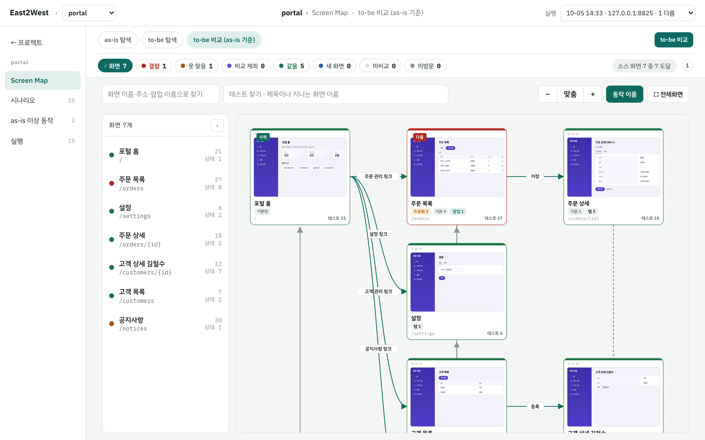
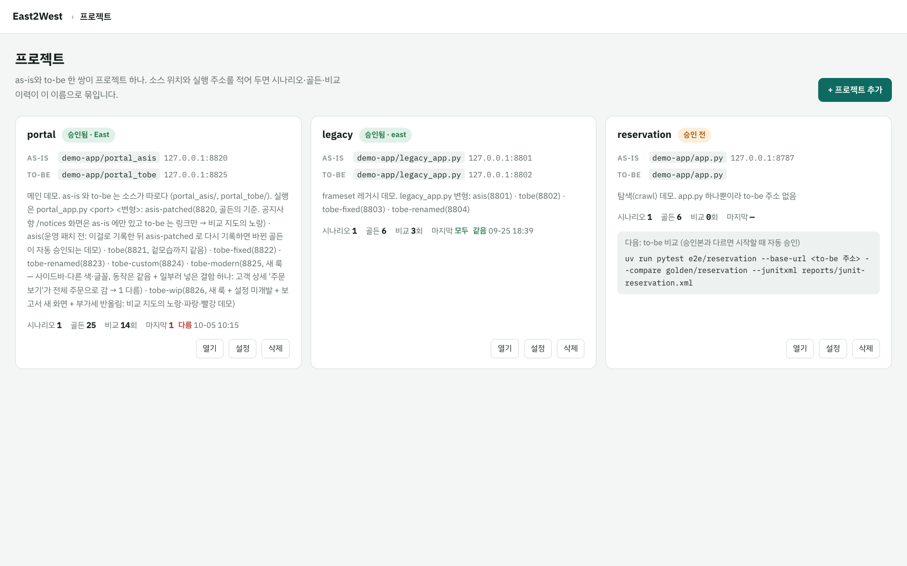
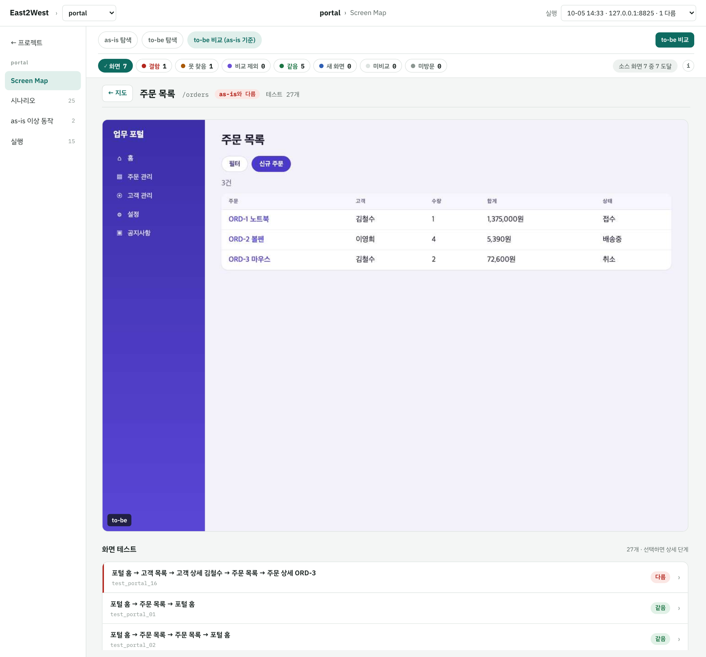
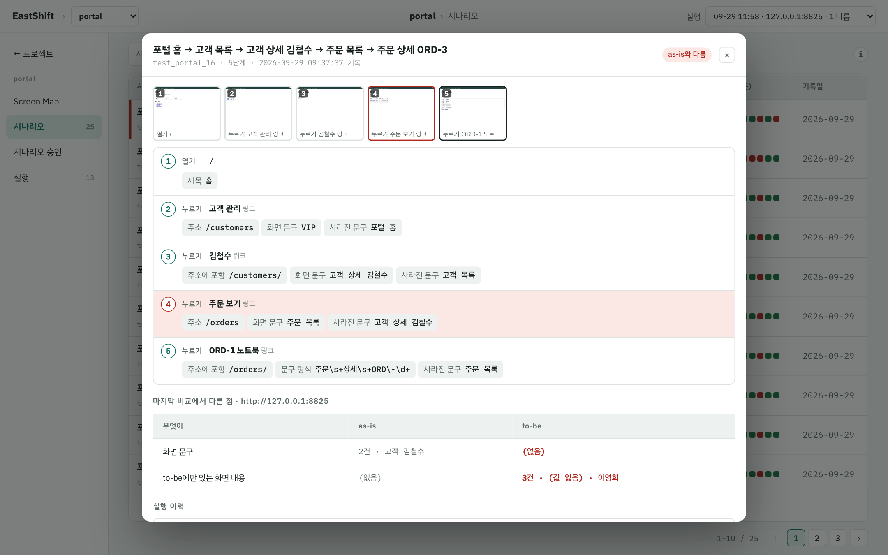
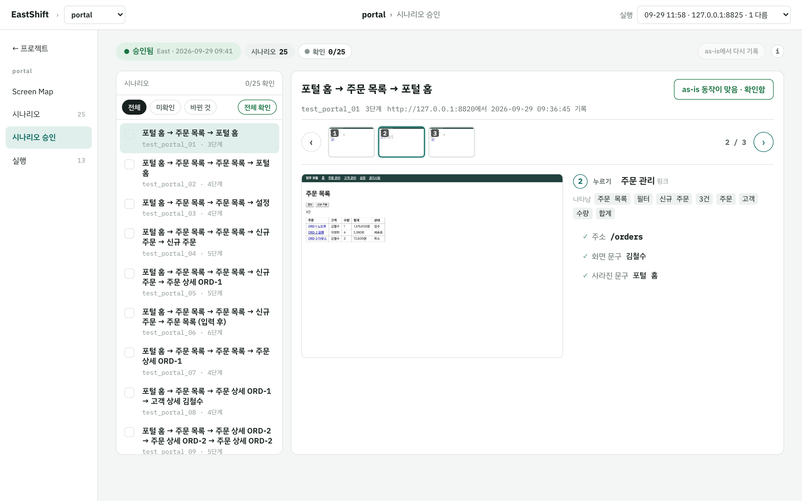
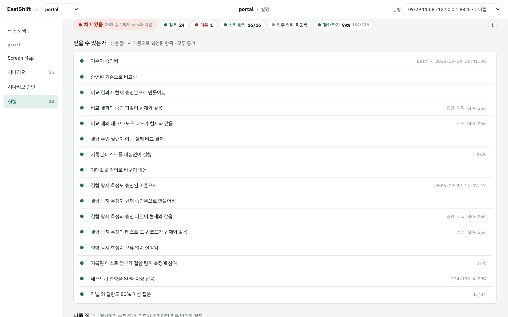
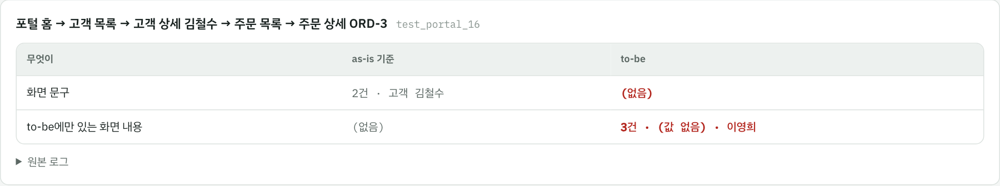

# EastShift

새로 만든 시스템(to-be)이 기존 시스템(as-is)과 **버그까지 똑같이** 동작하는지 검증하는 도구. 차세대 전환 프로젝트용.



정답(오라클)은 코드의 의도가 아니라 **실행 중인 as-is의 관찰 결과**다. 세 가지 약속 위에 서 있다.

- **승인은 사람이.** 사람이 확인하고 승인한 골든만 비교의 기준이 된다. 에이전트는 골든을 쓰지도 승인하지도 못한다.
- **판정은 기계가, 규칙으로.** 텍스트 생성 LLM은 쓰지 않는다. 같은 입력이면 늘 같은 결과가 나온다. Jev(선택형 모델)는 세 곳에서만 선택적으로 쓰고, API 키 없이 전체 흐름이 돈다.
- **테스트도 검증한다.** 결함 주입으로 테스트가 실제로 결함을 잡는지 재고, 80% 아래면 비교 결과를 믿지 않는다.

그래서 에이전트(Claude Code)가 테스트를 쓰고 돌려도 결과를 믿을 수 있다.

## 5분 데모

```bash
uv sync && uv run playwright install chromium
python demo-app/portal_app.py 8820 asis-patched &   # as-is
python demo-app/portal_app.py 8825 tobe-modern &    # to-be (새 룩 + 일부러 넣은 결함 하나)
uv run eastshift ui                                 # http://127.0.0.1:8790
```

`portal` 프로젝트를 열면 위 지도가 보인다. 화면 7개 중 5개 같음, `/orders` 하나가 **다름**(고객 상세의 "주문 보기"가 다른 고객 주문까지 보여 줌), `/notices` 하나가 **미개발**(as-is에만 있는 공지사항). 실행 탭의 판정은 "차이 있음 — 25개 중 1개, 신뢰 확인 16/16, 결함 탐지 134/135".

## 흐름

```
① 탐색 → ② 기록 → ③ 승인(사람) → ④ 결함 주입 → ⑤ to-be 비교 → ⑥ 판정
```

| 단계 | 화면에서 | 터미널에서 (CI·에이전트) |
| :--- | :--- | :--- |
| ① 탐색 · ② 기록 | Screen Map 탭 "Screen Map 만들기" (탐색 → 시나리오 초안 → 기록) | `uv run eastshift crawl <시작 URL> --out crawl/<app>` · `uv run pytest e2e/<app> --base-url $ASIS --record golden/<app>` |
| ③ 승인 | 시나리오 승인 탭: 확인 → 이름 → 승인 | (화면에서만) |
| ④ 결함 주입 | 실행 탭 "결함 탐지 측정" | `uv run eastshift mutate e2e/<app> --base-url $ASIS --compare golden/<app>` |
| ⑤ to-be 비교 | Screen Map "to-be 비교" · 실행 탭 "비교 다시 실행" | `uv run pytest e2e/<app> --base-url $TOBE --compare golden/<app> --junitxml reports/junit-<app>.xml` |
| ⑥ 판정 | 실행 탭 | `uv run eastshift report --oracle golden/<app> --junit reports/junit-<app>.xml --mutation reports/mutation-<app>-golden.json --out reports/verification-<app>.md` |
| 수정 → 재실행 | 실행 탭 "지난 실행 대비" | `uv run eastshift status golden/<app>` |

사람이 보는 화면은 전부 `eastshift ui` 한 곳이고, 파일로 따로 떨구는 명령은 없다. 절차와 신뢰 장치 전체는 [docs/MIGRATION.md](docs/MIGRATION.md).

## 통합 화면

### 프로젝트



프로젝트 = as-is와 to-be 한 쌍. 소스 위치와 실행 주소를 적으면 시나리오·골든·비교 이력이 이 이름으로 묶인다. 카드 하나에 승인 상태, 시나리오 수, 마지막 비교 결과가 있다.

### Screen Map

화면을 카드로, 이동 경로를 선으로 펼친다. 출처 셋: **as-is 탐색 / to-be 탐색 / to-be 비교(as-is 기준)**.

| 색 | 뜻 |
| :--- | :--- |
| 초록 | as-is와 같음 |
| 빨강 | as-is와 다름 (비교 실행에서 다르게 동작) |
| 노랑 | 미개발 — as-is에는 있는데 to-be 탐색에서 못 찾음 |
| 파랑 | to-be에만 있는 새 화면 |
| 회색 | 코드에만 있음 — 소스는 선언하는데 탐색·시나리오가 못 간 화면 |



카드를 누르면 그 화면 한 장: 큰 캡처(마우스를 올리면 as-is ↔ to-be), 시작에서 오는 길, 갈 수 있는 곳, 이 화면을 지나는 테스트(다른 것이 맨 위). 탐색 지도는 "다시 탐색"으로 갱신하고, 소스 위치가 있으면 라우트 대조로 "소스 화면 N 중 M 도달"을 같이 보여 준다.

### 시나리오



골든 시나리오의 현황판. 행마다 마지막 결과와 실행 이력 점, 누르면 단계 필름스트립·확인한 값·"무엇이 · as-is · to-be" 표.

### 시나리오 승인



기록된 as-is 동작이 정말 맞는지 사람이 단계별 캡처를 보고 확인한다. 전부 확인하면 이름 입력란과 승인 버튼이 나온다. 승인하면 골든 파일의 해시가 잠기고, 이후 골든이 바뀌면 비교가 거부된다. 재승인 때는 지난 승인 대비 바뀐 곳만 표시되고, as-is가 바뀌었으면 **as-is에서 다시 기록** 버튼으로 골든을 새로 뜬다.

### 실행



to-be 비교 실행의 이력(대상, 승인본, 결과, 지난 실행 대비)과 고른 실행의 판정. 판정은 셋을 따로 본다: **증거를 믿을 수 있는가**(승인된 기준, 같은 코드, 테스트 빠짐없이, 기대값 임의 변경 없음, 결함 탐지 80% 이상), **실행한 시나리오가 같은가**, **등록한 업무 범위를 다 돌았는가**. 빨간 항목 옆 "바로 해결"이 비교·결함 탐지 측정을 바로 돌린다.



다른 시나리오는 diff 로그 대신 "무엇이 · as-is 기준 · to-be" 표와 실패 순간 캡처로 본다. 레이아웃이 바뀌어도 내용이 같으면 같다고 보고, 주문번호·날짜처럼 매번 바뀌는 값은 가린다.

## 결함 주입

테스트 자체를 테스트한다. 비교에서 "모두 같음"이 나와도 테스트가 허술해서 못 알아챈 것일 수 있으므로, as-is 응답을 가로채 결함을 **하나씩** 넣고(숫자 끝자리, 반올림, 조건 뒤집기, 알림창, 문구, 500) 테스트가 잡는지 센다. 놓친 결함은 사람이 판정한다: 테스트 빈틈이면 확인 값을 보강하고, 화면에 안 나타나는 동등 결함이면 `oracle.json`의 `equivalent_mutants`에 사유와 함께 적는다. as-is와 승인된 골든만 쓰므로 to-be가 완성되기 전에 미리 돌려 둘 수 있다.

## 도구 구성

| 도구 | 하는 일 | 쓰는 곳 |
| :--- | :--- | :--- |
| **Playwright `ui` fixture** (`eastshift/pwtest`, pytest 플러그인) | 프레임 무관 요소 찾기, 대화상자, 위젯 어댑터, as-is 골든 기록/비교, 사람 승인, 결함 주입, 검증 보고서 | 핵심 업무 흐름의 as-is/to-be 동등성 |
| **탐색기** (`eastshift crawl`) | 화면의 동작을 모두 눌러 흐름 그래프, 시나리오, Playwright 테스트 초안 생성. 목록은 분기 열(상태·유형)의 값마다 대표 행만 누른다 (분기 열: 픽스처 > Jev 분류 > 규칙). 텍스트 생성 LLM 없음 | 흐름 지도, 스모크·테스트 초안 |
| **라우트 대조** (`eastshift routes`) | 소스의 라우팅 선언(Flask·Spring·Express·JSP·Struts·손 라우팅 …)에서 화면 주소 목록을 뽑아 지도와 대조 | 탐색 완전성 확인 |
| **YAML 러너** (`eastshift run`) + `eastshift targets` | 시나리오 하나를 화면 목록에 돌림. 화면별 조회 버튼은 실행 전에 규칙으로 정하고 애매한 것만 사람이 고름 | 화면 수백 개를 넓게 훑는 스모크 |
| **실패 분류** (`eastshift run --triage`, `eastshift triage`) | 실패·diff 스텝의 원인을 Jev가 분류표(ui_changed·real_defect·environment·timing·test_bug) 안에서 고른다. 낮은 margin만 사람 검토 | 스모크 결과 정리 |

Jev는 YAML 러너의 자연어 스텝, 탐색의 목록 표본 열, 실패 분류에서만 선택적으로 쓴다 ([docs/YAML_RUNNER.md](docs/YAML_RUNNER.md)). 테스트 작성은 Claude Code 스킬이 맡는다: `e2e-tests`(동등성 검증), `smoke`(전체 화면 스모크).

```bash
uv run eastshift targets scenarios/<app>/screens.yaml --base-url $ASIS --out scenarios/<app>/screens.targets.yaml   # 조회 버튼 정하기 (누르지 않음)
uv run eastshift run scenarios/<app>/screen_smoke_targets.yaml --base-url $TOBE --junit reports/junit-smoke.xml --workers 4   # 화면이 많으면 브라우저 여러 개
uv run eastshift crawl <시작 URL> --fixtures f.yaml --out crawl/<app> --dry-run   # 누를 버튼 확인 (저장·확정도 실제로 누른다)
uv run eastshift routes <소스 폴더> --out crawl/<app>/routes.json                  # 소스가 선언한 화면 주소 → 지도가 못 간 화면을 회색으로
```

## 설정

- **서버 초기화·시각 고정**: 테스트마다 대상 앱의 테스트 전용 POST 엔드포인트를 부르고 브라우저 시각을 고정할 수 있다. `--record`에 준 설정은 골든에 기록되어 `--compare`와 `eastshift mutate`가 자동으로 재사용한다.
  ```bash
  uv run pytest e2e/<app> --base-url $ASIS --record golden/<app> --reset-path /test/reset --fixed-time 2026-09-27T09:00:00+09:00
  ```
- **`golden/<app>/oracle.json`**: `ignore`(매번 바뀌는 값 가림), `coverage`(필수 업무 경우와 테스트 연결), `allowed_differences`(승인된 diff의 SHA-256과 사유), `equivalent_mutants`(동등 결함), `api_compare`(화면에 안 보이는 API 응답도 비교할 경로), `redact_fields`·`redact_patterns`(저장 전 민감정보 제거). API 비교와 민감정보 규칙은 **기록 전에** 정하고, 이 파일을 바꾸면 다시 승인해야 한다. 라벨이 의도적으로 바뀐 to-be는 `name_map.<target>.json`.
- **규모가 크면**: 비교는 `pytest … -n 4`(브라우저 4개, 원장은 한 건. `--reset-path`와는 같이 못 씀), 스모크는 `--workers 4`, 결함 주입은 끊겨도 같은 명령으로 이어서 돌고 `--max-mutants N`으로 상한을 준다. 실행 사본 폴더는 최근 30개만 남긴다(`EASTSHIFT_KEEP_RUNS`). 화면 수천 개면 모듈마다 프로젝트를 등록해 지도·승인을 나눈다.

## 문서

| 문서 | 내용 |
| :--- | :--- |
| [docs/MIGRATION.md](docs/MIGRATION.md) | 전환 검증 절차(탐색 → 시나리오 → 기록 → 승인 → 비교 → 원장 → 루프), 신뢰 장치 표, 관리 화면, 데모 결과 |
| [docs/confluence/](docs/confluence/eastshift-ui.confluence) | 통합 화면 소개글 (Confluence 위키 마크업 + portal 캡처 10장) |
| [docs/samples/README.md](docs/samples/README.md) | 산출물 샘플: 단계마다 무엇이 나오고 누가 읽는지 (실제 데모 실행 결과) |
| [docs/SMOKE.md](docs/SMOKE.md) | 시나리오 하나로 화면 N개 스모크 (matrix) |
| [docs/CRAWL.md](docs/CRAWL.md) | 화면 탐색기: 동작 방식, 안전장치, 산출물, 규모가 크면 |
| [docs/YAML_RUNNER.md](docs/YAML_RUNNER.md) | Jev 러너: 시나리오 형식, expect 키, 동작 원리, 한계 |
| 설명서 HTML | [docs/eastshift-how.html](docs/eastshift-how.html) (작동 원리, Jev를 쓰는 곳·안 쓰는 곳), [docs/eastshift-overview.html](docs/eastshift-overview.html), [docs/eastshift-eli5.html](docs/eastshift-eli5.html) (쉬운 설명) |
| 실험 기록 | [docs/JEV_VS_PLAYWRIGHT.md](docs/JEV_VS_PLAYWRIGHT.md) (요소 찾기 방식 비교 → 역할 분담의 근거), [docs/DEV_LOOP.md](docs/DEV_LOOP.md) (개발 루프 세 바퀴), [docs/COST_COMPARISON.md](docs/COST_COMPARISON.md) (Jev vs 일반 LLM 토큰 비용) |

## 저장소 구성

```
eastshift/         패키지. pwtest/ (Playwright 검증, 통합 화면 hub.py, 원장 ledger.py, 결함 주입 mutation.py), runner.py·snapshot.py·jev.py (Jev 러너),
                   crawl.py·clicks.py (탐색, 누른 동작 기억), routes.py (라우트 대조), observe.py (비교 정규화)
e2e/<app>/         Playwright 테스트                golden/<app>/   승인된 오라클 (골든, 스크린샷, 규칙, APPROVED.json)
eastshift.json     프로젝트 등록부: as-is/to-be 소스 위치·실행 주소 (eastshift ui 첫 화면에서 추가·설정)
runs/<app>/        to-be 비교 실행 원장 (실행마다 JSON + JUnit·스크린샷 사본, mutations/ 결함 주입 결과, approved/ 지난 승인본 사본)
scenarios/         YAML 시나리오 (스모크, 데모)      examples/       YAML 전환 예제, 비교 실험 코드, crawl 픽스처
demo-app/          데모 서버. 포털(메인 데모: as-is 소스 portal_asis/ 와 to-be 소스 portal_tobe/ 가 따로, 변형 8개는 portal_app.py <port> <변형>),
                   레거시 주문(frameset 특수 케이스), 예약(crawl), ERP 화면 12개(스모크)
tools/             explore.py (요소 이름 탐색), guard_oracle.py (Claude Code hook: golden/ 편집·승인 차단)
.claude/skills/    e2e-tests, smoke
```

`reports/`, `.eastshift-cache/`, `crawl/`, `.env`, `.auth/`는 커밋하지 않는다.

## 라이선스

[PolyForm Noncommercial 1.0.0](LICENSE). 개인·연구·교육·평가·비영리·공공 목적의 사용, 수정, 배포는 자유다. **상업적 사용**(회사 안에서의 사용, 유료 프로젝트·용역, 제품·서비스의 일부로 쓰는 것 모두)은 저작권자와 별도 서면 협의가 필요하다. 협의는 [GitHub 이슈](https://github.com/East-KR/eastshift/issues)로.
