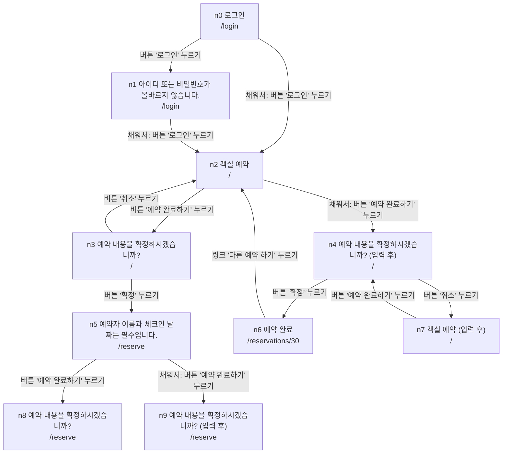

# 화면 탐색 결과

시작: `http://127.0.0.1:8787/login`, 상태 10개, 동작 26개

## 동작

| 상태 | 방식 | 동작 | 결과 | 비고 |
| :--- | :--- | :--- | :--- | :--- |
| n0 | as-is | 버튼 "로그인" 누르기 | → n1 | HTTP 401 http://127.0.0.1:8787/login |
| n0 | filled | 버튼 "로그인" 누르기 | → n2 |  |
| n1 | as-is | 버튼 "로그인" 누르기 | 화면 안 | HTTP 401 http://127.0.0.1:8787/login |
| n1 | filled | 버튼 "로그인" 누르기 | → n2 |  |
| n2 | as-is | "2026.10." 영역의 버튼 "1" 누르기 | 화면 안 | 비슷한 요소 31개 중 대표; 선택한 체크인 = 2026-10-01 |
| n2 | as-is | "2026.11." 영역의 버튼 "1" 누르기 | 화면 안 | 비슷한 요소 30개 중 대표; 선택한 체크인 = 2026-11-01 |
| n2 | as-is | 옵션 "1박" 선택 | 화면 안 | 비슷한 요소 3개 중 대표 |
| n2 | as-is | 체크박스 "조식 포함" 체크 | 화면 안 |  |
| n2 | as-is | 버튼 "예약 완료하기" 누르기 | → n3 |  |
| n2 | filled | 버튼 "예약 완료하기" 누르기 | → n4 |  |
| n3 | as-is | 버튼 "확정" 누르기 | → n5 | HTTP 400 http://127.0.0.1:8787/reserve |
| n3 | as-is | 버튼 "취소" 누르기 | → n2 |  |
| n4 | as-is | 버튼 "확정" 누르기 | → n6 |  |
| n4 | as-is | 버튼 "취소" 누르기 | → n7 |  |
| n5 | as-is | "2026.10." 영역의 버튼 "1" 누르기 | 화면 안 | 비슷한 요소 31개 중 대표; 선택한 체크인 = 2026-10-01 |
| n5 | as-is | "2026.11." 영역의 버튼 "1" 누르기 | 화면 안 | 비슷한 요소 30개 중 대표; 선택한 체크인 = 2026-11-01 |
| n5 | as-is | 옵션 "1박" 선택 | 화면 안 | 비슷한 요소 3개 중 대표 |
| n5 | as-is | 체크박스 "조식 포함" 체크 | 화면 안 |  |
| n5 | as-is | 버튼 "예약 완료하기" 누르기 | → n8 |  |
| n5 | filled | 버튼 "예약 완료하기" 누르기 | → n9 |  |
| n6 | as-is | 링크 "다른 예약 하기" 누르기 | → n2 |  |
| n7 | as-is | "2026.10." 영역의 버튼 "1" 누르기 | 화면 안 | 비슷한 요소 31개 중 대표 |
| n7 | as-is | "2026.11." 영역의 버튼 "1" 누르기 | 화면 안 | 비슷한 요소 30개 중 대표; 선택한 체크인 = 2026-11-01 |
| n7 | as-is | 옵션 "1박" 선택 | 화면 안 | 비슷한 요소 3개 중 대표 |
| n7 | as-is | 체크박스 "조식 포함" 체크 | 화면 안 |  |
| n7 | as-is | 버튼 "예약 완료하기" 누르기 | → n4 |  |

## 탐색하지 않은 상태 (깊이 4 도달)

- n8 예약 내용을 확정하시겠습니까?
- n9 예약 내용을 확정하시겠습니까? (입력 후)
